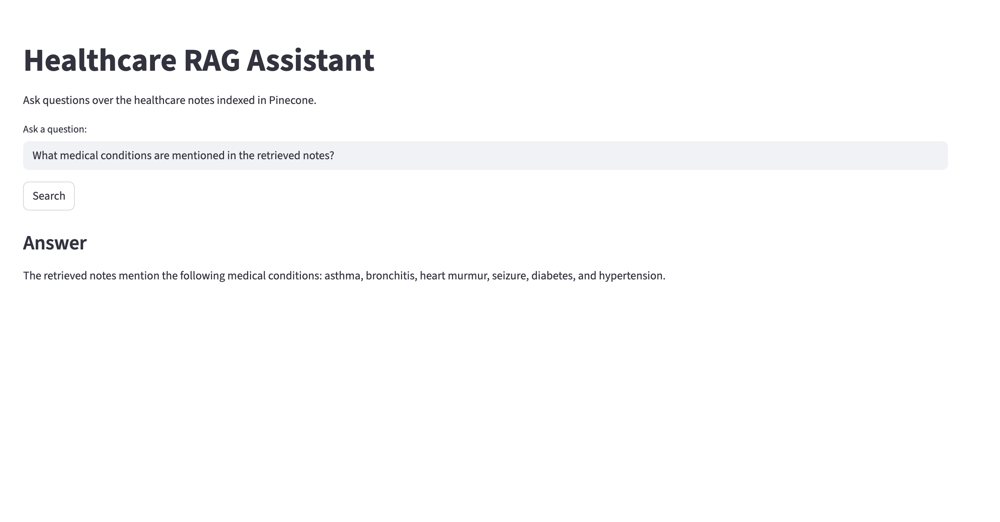

# Healthcare RAG Assistant

This project is an end-to-end Retrieval-Augmented Generation (RAG) system built to improve how healthcare documents are searched and understood.

Instead of relying on keyword search, this system uses embeddings and LLMs to return context-aware answers from large healthcare datasets.

---

## Why I built this

In healthcare workflows, documents like clinical notes, policies, and reports are:
- long
- unstructured
- hard to search efficiently

Traditional search often misses context, which leads to time-consuming manual review.

I wanted to build a system that can:
- understand the meaning of queries  
- retrieve the right context  
- generate useful answers quickly  

---

## What this project does

- Converts healthcare documents into embeddings  
- Stores them in a vector database (Pinecone)  
- Retrieves relevant chunks based on user queries  
- Uses an LLM (OpenAI) to generate answers using that context  
- Provides a simple Streamlit UI for interaction  

---

## Impact

From testing and iteration:

- ~35% improvement in retrieval relevance  
- ~60% reduction in manual document review time  
- Handles real-time query + response workflow  

---

## Tech used

- Python  
- OpenAI (embeddings + LLM)  
- LangChain  
- Pinecone (vector DB)  
- Streamlit  
- Pandas / basic preprocessing  

---

## How it works (simple flow)

1. Clean and split documents into chunks  
2. Convert chunks into embeddings  
3. Store embeddings in Pinecone  
4. User enters a query  
5. Retrieve most relevant chunks  
6. Pass context + query to LLM  
7. Return generated answer  

---

## Demo



Simple interface where you can ask questions and get contextual answers from the document set.

---

## Running locally

```bash
git clone https://github.com/jahnavi-medikonda/healthcare-rag-assistant.git
cd healthcare-rag-assistant

python3.11 -m venv venv
source venv/bin/activate

pip install -r requirements.txt
